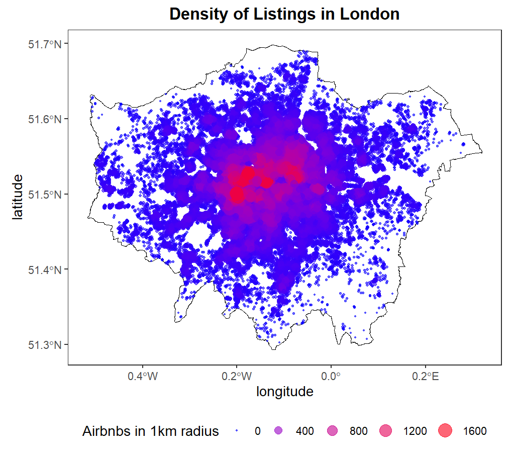
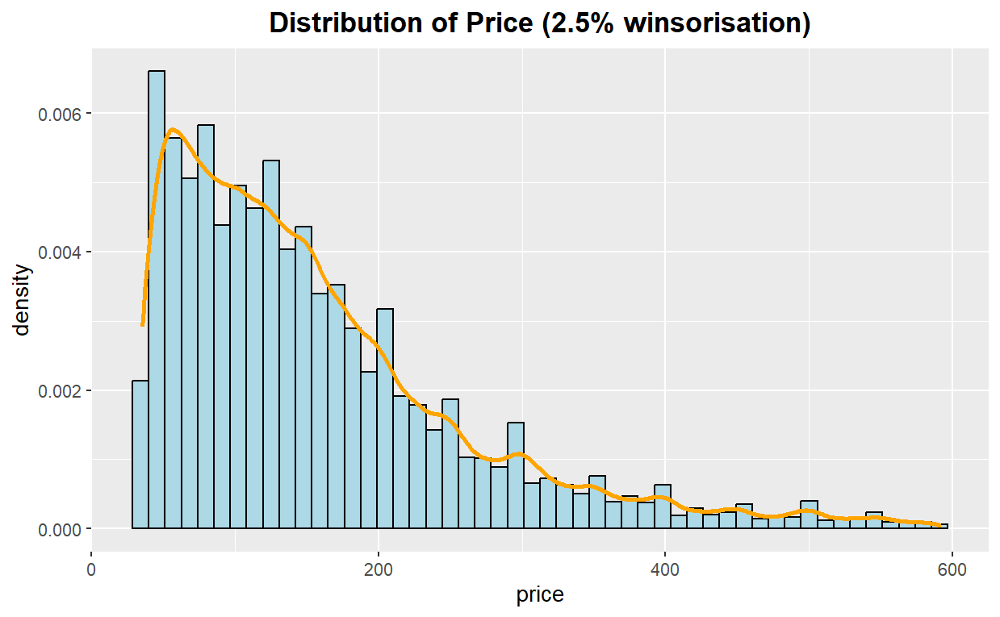
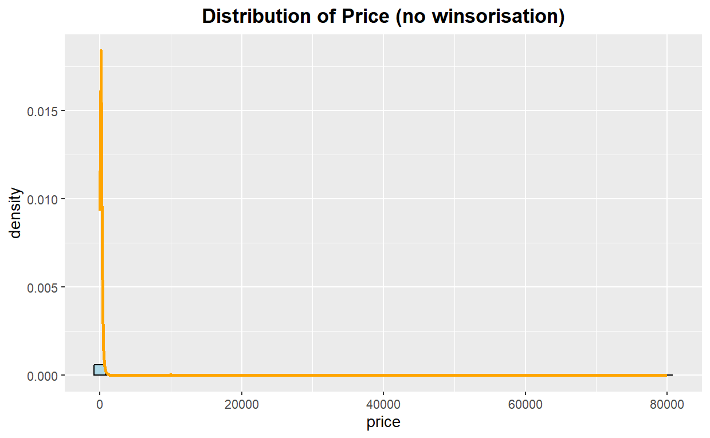
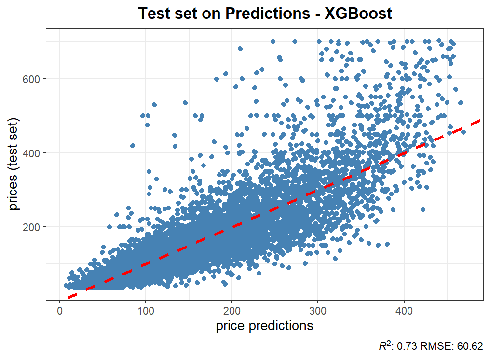
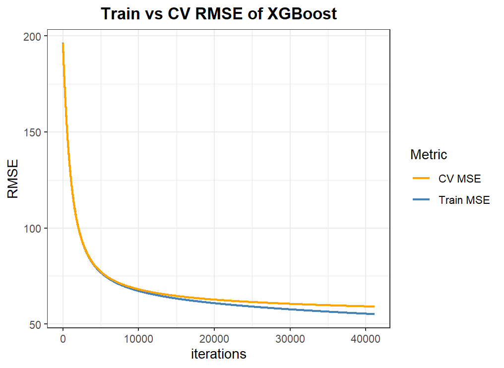

# Introduction

Airbnb is a digital platform that enables homeowners to lease their
properties short-term, offering customers an alternative to the
traditional hospitality industry. With the rapid growth of the
short-term rental market, accurate pricing is essential for hosts to
maximise profits and allocate resources efficiently, for consumers to
maximise utility given the costs, and for policymakers to promote fair
competition within the market and in relation to the hospitality
industry.

In this project, the gradient-boosted model is trained, fine-tuned and
tested to predict Airbnb prices using data from the city of London
scraped by Inside Airbnb from December 2024. The gradient-boosted tree
achieved an out-of-sample $`R^2`$ of 72.5% and a root mean-squared error
of 60.122, respectively.

# Economic Framework

Using standard economic theory, I assume that a host sets prices to
maximise profit based on costs, competitors’ prices, and expected
demand. However, this market exhibits information asymmetry, where a
consumer cannot ex-ante assess the quality of a listing.(Abrate,
Capriello and Fraquelli, 2011). Therefore, hosts are incentivised to
present credible signals to justify higher prices and attract demand.

Following (Spence, 1973), sellers (hosts) with hidden quality invest in
observable signals, such as verified identity status and amenities, to
differentiate themselves. While there are tangible signals, such as
bedrooms, that are directly attributable to the stay, intangible
signals, including verified identity, also exist, serving as trust
mechanisms that allow for price differentiation. Since both tangible and
intangible signals influence prices, this project uses them within a
machine learning framework to estimate Airbnb prices.

# Data

## Feature Selection

First, all irrelevant and duplicated variables, including URLs (e.g.,
`host_picture_url` and `host_picture_url`) and identifiers (e.g.,
`host_id` and `scrape_id`), apart from `id`, are removed, as
web-scraping is not conducted due to memory constraints and lack of
necessity for multiple identifiers. Similar to (Yao *et al.*, 2019), all
the chosen features are organised into four categories:

1.  **Listing Attributes:** Basic listing attributes, such as the number
    of guests accommodated, bedrooms, bathrooms, and beds, are
    significantly associated with prices, as they provide essential
    information regarding the services offered. (Wang and Nicolau,
    2017). As these features indicate the nature of the service and are
    relatively more correlated with price, as seen in Figure
    <a href="#fig:corrmap" data-reference-type="ref"
    data-reference="fig:corrmap">1</a>, they are selected.

    <figure id="fig:corrmap">
    
    <figcaption>correlation heatmap of listings’ attributes &amp;
    traditional signals</figcaption>
    </figure>

2.  **Host Attributes:** Being a
    [Superhost](https://www.airbnb.co.uk/help/article/829), possessing a
    higher host listing count, and verified identity are significantly
    positively associated with price and are therefore selected. This is
    due to the host’s increased perceived credibility and reputation,
    allowing them to charge a premium. (Wang and Nicolau, 2017;
    Airbnb, 2022) Response rates, acceptance rates and response times
    are also included to capture the reputation effects of hosts who are
    not superhosts. Finally, assuming that more experienced hosts adjust
    their prices more efficiently, a proxy for experience is constructed
    by considering the duration from when a person becomes a host to the
    day the data is scraped.

3.  **Spatial Attributes:** Spatial information plays a significant role
    in consumer decision-making for accommodations. For example, a
    listing in the city center is preferred due to its proximity to
    popular tourist attractions.(Masiero, Yang and Qiu, 2019) Therefore,
    a proxy for distance from the center of London is used, and another
    proxy for the nearest tube is created using data provided by
    Transport for London to capture connectivity. Additionally, the
    quantity of listings within a 1 km radius of a specific observation
    is constructed to assess spatial spillover effects, reflecting the
    region’s competitiveness and popularity, as observed in central
    London (illustrated in Figure
    <a href="#fig:listing_density" data-reference-type="ref"
    data-reference="fig:listing_density">2</a>). (Yang, Mueller and
    Croes, 2016)

    <figure id="fig:listing_density">
    
    <figcaption>Density of Listings in London</figcaption>
    </figure>

4.  **Traditional Signals:** Traditional signals, such as review scores
    for cleanliness, location, communication, and check-in, act as
    peer-to-peer verification of a host’s credibility and are not
    omitted. (Yao *et al.*, 2019)

## Data Pre-processing and Feature Engineering

All selected features are reformatted into their correct data types, and
the variables mentioned in the previous subsection are constructed. As
descriptions of the listing and neighbourhood increase the likelihood of
booking, they are considered variables that need to be included. (Yao
*et al.*, 2019). Furthermore, it is reasonable to assume that
descriptions of the host can also indicate reliability and are thus
included. To incorporate such text data meaningfully, a sentence
transformer, `all-miniLM-l6-v2`, embeds each text piece for a given
observation into a 384-dimensional vector that preserves a sentence’s
semantic and contextual meaning. (Turton, Smith and Vinson, 2021) This
specific transformer model structure is chosen because its smaller size,
trained by distilling BERT, offers similar performance at lower
computational costs. (Wang *et al.*, 2020; Thakur *et al.*, 2021)
Amenities are also embedded to capture all the minor differences between
the offerings.

Due to this process, the total number of columns in the embedding matrix
adds up to 1536. Principal component analysis is applied to the matrix
to reduce dimensionality, retaining only dimensions that capture 80% of
the matrix’s variation. Finally, all numeric data types are normalised
to ensure features with different scales contribute equally to the
model, and all categorical variables are binarised to help the model
learn separate weights for each category and observe the impact of
individual categories.  
Finally, to avoid the effects of potential bias from extreme
outliers—such as a listing priced at over £80,000 per night (as
illustrated in Figure
<a href="#fig:price_dist" data-reference-type="ref"
data-reference="fig:price_dist">3</a>)—prices are winsorised at the 2.5%
level.

<figure id="fig:price_dist">
  

    
    
  

  <figcaption>Distribution of Prices</figcaption>
</figure>

# Empirical Framework

## Model Selection

Following the arguments of (Hastie, Tibshirani and Friedman, 2009),
tree-based methods offer several advantages, including fast
construction, internal feature selection, robustness to data
transformation, and the ability to capture non-linearities. This is
particularly relevant in the context of this project, which involves
text embeddings and spatial information. Trees are particularly
advantageous for predicting prices, as they provide an average of the
target variable in a partition defined by the feature space [^1],
ensuring strictly non-negative predictions.

However, they often perform poorly on prediction tasks because of high
bias (when the tree structure is too simple) or high variance (when
excessive complexity leads to overfitting). To tackle this issue,
gradient-boosted models are chosen as the primary method, as they
conduct a form of adaptive learning whereby each successive round of
boosting compensates for the weaknesses of its predecessors, thereby
improving the overall predictive performance.

## Training and Tuning

The sample was divided into training, validation, and test sets in a
60:20:20 ratio during the training process. The hyperparameters were
manually tuned using the train and validation sets and evaluated against
the test set. Figure <a href="#fig:corrmap" data-reference-type="ref"
data-reference="fig:corrmap">1</a> shows that certain variables exhibit
high correlation. Instead of omitting one of the collinear features,
heavier L2 penalisation is used, as it alleviates the problem by
shrinking a feature’s coefficient, introducing bias and preventing
coefficients from being highly sensitive to small changes in data,
thereby reducing variance.  
Boosting trees are designed as slow learners to incrementally refine
predictions, ensuring minor, controlled updates that learn rapidly
initially and optimise in later rounds. (Hastie, Tibshirani and
Friedman, 2009). Therefore, this approach is adopted to tune the model,
leading to hyperparameters as seen in table
<a href="#tab:hyper_params" data-reference-type="ref"
data-reference="tab:hyper_params">1</a>. It balances bias and variance,
enabling the algorithm to capture complex patterns while maintaining
robustness and stability. Finally, early stopping with only two rounds
ensures that if the cross-validation error does not improve
consecutively for two rounds, the training process must stop, as the
model starts to overfit and does not generalise well.

|            Hyper-parameter            | Value |
|:-------------------------------------:|:-----:|
|       learning rate ($`\eta`$)        | 0.001 |
|              tree depth               |   5   |
|         subsample proportion          | 0.26  |
| proportion of features used per round | 0.82  |
|     cost complexity ($`\gamma`$)      |  0.3  |
|    L2 regularisation ($`\lambda`$)    | 2000  |
|    L1 regularisation ($`\alpha`$)     |  0.2  |
|     number of rounds of boosting      | 50000 |
|            early stopping             |   2   |

Tuned Hyper-parameters of XGBoost

## Results

The XGBoost model, on average, mis-specifies the price by \$38.051 (as
reported in dollars), as shown in Table
<a href="#tab:hyper_params" data-reference-type="ref"
data-reference="tab:hyper_params">1</a>. These errors can be attributed
to under-pricing the more expensive listings, as illustrated in Figure
<a href="#fig:xgb_res" data-reference-type="ref"
data-reference="fig:xgb_res">4</a>(a). However, the smooth exponential
decay with minor divergence between training and cross-validation error
in Figure <a href="#fig:xgb_res" data-reference-type="ref"
data-reference="fig:xgb_res">4</a>(b) suggests that the learning process
is relatively stable, with rapid decreases in both bias and variance
until 10000 iterations, and a subsequent increase in variance,
indicating a slightly over-fit model.

| Evaluation metrics |  train | cross validation |   test |
|:-------------------|-------:|-----------------:|-------:|
| RMSE               | 55.137 |           59.070 | 60.619 |
| MAE                | 35.159 |           37.547 | 38.051 |
| $`R^2`$            |  0.764 |            0.729 |  0.725 |
| \# Observations    |  26120 |             8707 |   8707 |

Evaluation scores of XGBoost

  
With an RMSE of 55.14, this limitation may be due to omitted-variable
bias. First, (Dogru and Pekin, 2017) find that images of listings
significantly impact customers’ booking behaviour. Second, more
expensive listings may not compete with other listings but the
traditional hospitality industry. So, a listing may not need to undercut
its cheaper counterpart but the relatively more expensive hotel. Third,
the prices were scraped in December, making certain listings,
particularly those closer to Christmas festivities and tourist spots,
more expensive. Since images, pricing dynamics with hotels, and seasonal
components are omitted, they might be the primary reasons the model
predicts a lower price.

To conclude, this project trains a gradient-boosted model with
satisfactory performance. However, incorporating more data and refining
hyper-parameter tuning through methods such as Bayesian optimisation may
further enhance the model’s predictive power.

<figure id="fig:xgb_res">

    
    
  

<figcaption>XGBoost Results</figcaption>
</figure>

# References

Abrate, G., Capriello, A. and Fraquelli, G. (2011) ‘When quality signals
talk: Evidence from the Turin hotel industry’, *Tourism Management*,
32(4), pp. 912–921. Available at:
<https://doi.org/10.1016/j.tourman.2010.08.006>.

Airbnb (2022) ‘What’s required to be a Superhost - Airbnb Help Centre’,
*Airbnb*. Available at: <https://www.airbnb.co.uk/help/article/829>
(Accessed: 24 March 2025).

Dogru, T. and Pekin, O. (2017) ‘What do guests value most in Airbnb
accommodations? An application of the hedonic pricing approach’.

Hastie, T., Tibshirani, R. and Friedman, J. (2009) *The Elements of
Statistical Learning*. New York, NY: Springer (Springer Series in
Statistics). Available at: <https://doi.org/10.1007/978-0-387-84858-7>.

Masiero, L., Yang, Y. and Qiu, R.T.R. (2019) ‘Understanding hotel
location preference of customers: Comparing random utility and random
regret decision rules’, *Tourism Management*, 73, pp. 83–93. Available
at: <https://doi.org/10.1016/j.tourman.2018.12.002>.

Spence, M. (1973) ‘Job Market Signaling\*’, *The Quarterly Journal of
Economics*, 87(3), pp. 355–374. Available at:
<https://doi.org/10.2307/1882010>.

Thakur, N. *et al.* (2021) ‘Augmented SBERT: Data Augmentation Method
for Improving Bi-Encoders for Pairwise Sentence Scoring Tasks’. arXiv.
Available at: <https://doi.org/10.48550/arXiv.2010.08240>.

Turton, J., Smith, R.E. and Vinson, D. (2021) ‘Deriving Contextualised
Semantic Features from BERT (and Other Transformer Model) Embeddings’,
in *Proceedings of the 6th Workshop on Representation Learning for NLP
(RepL4NLP-2021)*. Online: Association for Computational Linguistics, pp.
248–262. Available at: <https://doi.org/10.18653/v1/2021.repl4nlp-1.26>.

Wang, D. and Nicolau, J.L. (2017) ‘Price determinants of sharing economy
based accommodation rental: A study of listings from 33 cities on
Airbnb.com’, *International Journal of Hospitality Management*, 62, pp.
120–131. Available at: <https://doi.org/10.1016/j.ijhm.2016.12.007>.

Wang, W. *et al.* (2020) ‘MiniLM: Deep Self-Attention Distillation for
Task-Agnostic Compression of Pre-Trained Transformers’. arXiv. Available
at: <https://doi.org/10.48550/arXiv.2002.10957>.

Yang, Y., Mueller, N.J. and Croes, R.R. (2016) ‘Market accessibility and
hotel prices in the Caribbean: The moderating effect of
quality-signaling factors’, *Tourism Management*, 56, pp. 40–51.
Available at: <https://doi.org/10.1016/j.tourman.2016.03.021>.

Yao, B. *et al.* (2019) ‘Standing out from the crowd – an exploration of
signal attributes of Airbnb listings’, *International Journal of
Contemporary Hospitality Management*, 31(12), pp. 4520–4542. Available
at: <https://doi.org/10.1108/IJCHM-02-2019-0106>.

[^1]: Result from Problem Set 1, Question 6

